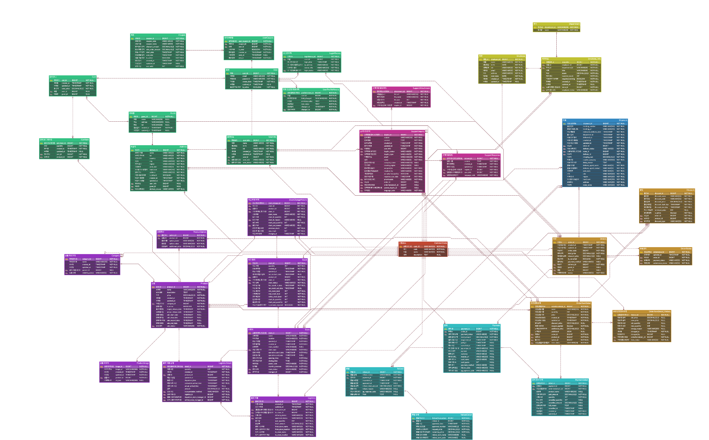
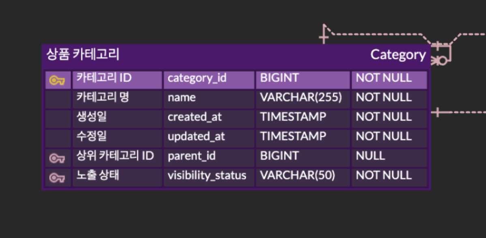
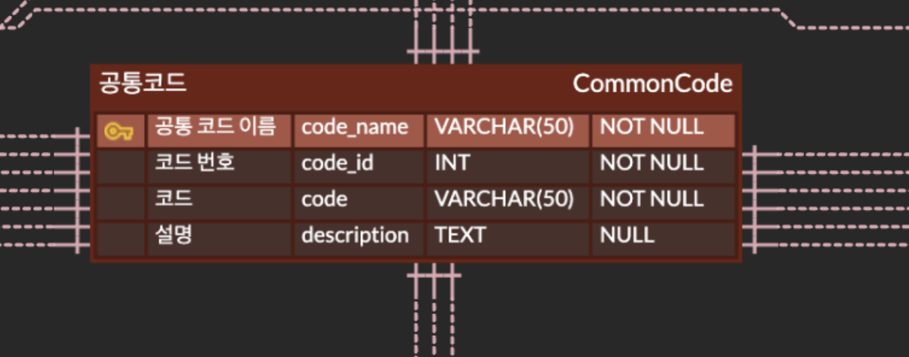
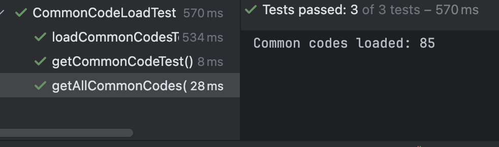
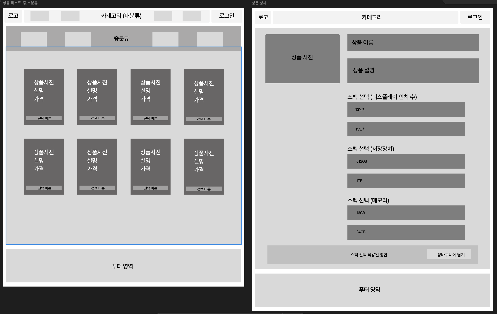
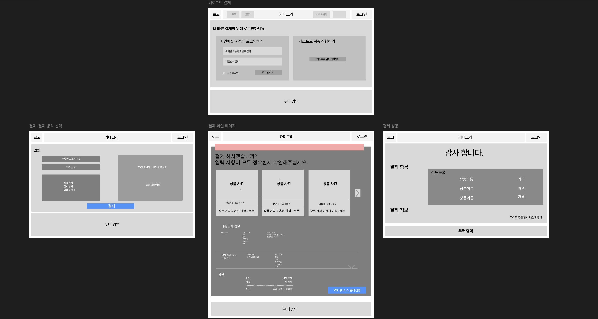
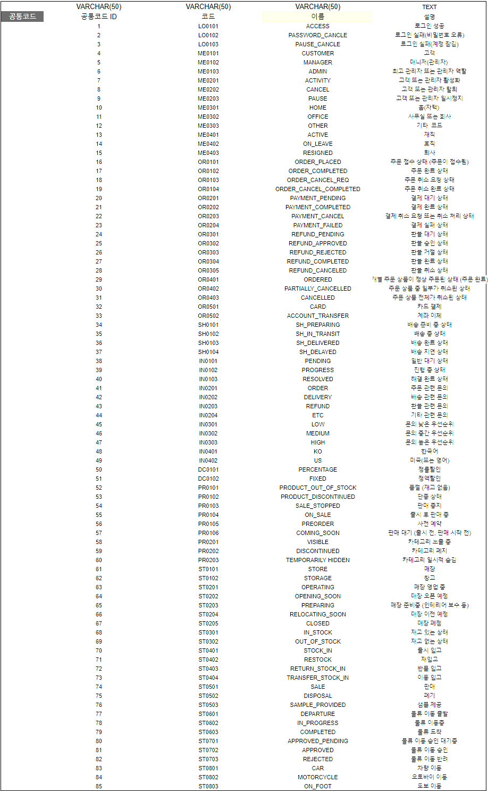

# 파인(FINE) 애플

'파인(FINE) 애플'은 정교하고 세밀한 브랜드의 철학을 반영한 쇼핑몰입니다.
브랜드의 이름은 "파인"이 주는 섬세한 아름다움과 정밀함을 강조하며,
"애플"은 그 자체의 상징성과 함께, 소비자에게 고급스럽고 가치 있는 제품을 제공하는 이미지를 전달합니다.

마치 애플 로고에서 한 입 베어먹은 형태처럼,'파인 애플'은 과학적이고 세련된 접근을 통해 고객에게 깊이 있는 제품 경험을 선사하는 것을 목표로 합니다.

## 기능 구현 과정 및 결과

### 프로젝트 구현 및 실행 조건
|완료여부|항목|자료|
|--|--|--|
|✅|ERD툴을 이용한 논리 모델링 작성|
|✅|물리모델링 & 테이블 생성 및 데이터 입력 스크립트 작성|[스크립트 디렉토리](/src/main/resources/db/migration)
|✅|mysql도커|[MYSQL 8.4.3을 사용하는 도커](/docker-compose.prod.yml)

### 프로젝트 요구 사항(필수)
기본 정보 테이블 & 행위 테이블 설계
|완료여부|항목|자료|
|--|--|--|
|✅|회원, 장바구니, 주문, 이력관리 등 테이블 생성|[테이블 생성 테이블](/src/main/resources/db/migration/V1__insert_initial_data.sql)
|✅|결제, 환불관련 및 모든 테이블 데이터 삽입|[데이터 삽입 전체 SQL문](/src/main/resources/db/migration/V5__insert_initial_data.sql)
|✅|공통코드 테이블 |[공통코드 테이블](src/main/resources/db/migration/V2__insert_initial_data.sql)

카테고리 & 코드 테이블 설계
|완료여부|항목|자료|
|--|--|--|
|✅|상품의 분류를 3계층으로 나눈 테이블 작성|
|✅|고객 직업, 주문상태, 결제 방법 등의 코드를 통합한 테이블 작성|

테이블 공통 필수 사항
|완료여부|항목|자료|
|--|--|--|
|✅|각 테이블에는 PK컬럼과 시스템 컬럼을 필수로 추가|

### 프로젝트 요구 사항(권장)
쿠폰 & 포인트 테이블 추가
|완료여부|항목|자료|
|--|--|--|
|✅|쿠폰 사용 조건과 정책을 위한 테이블 설계|
|❌|상품 구매시 발생하는 포인트를 관리하는 테이블 설계| 결제복잡도를 줄이기 위해 포인트 테이블을 따로 설계하지 않았음.

자바(JDBC)로 각 테이블의 데이터를 조회 및 검증
|완료여부|항목|자료|
|--|--|--|
|✅|JDBC로 MYSQL 연결 확인|
|✅|TDD로 테이블의 제약조건 (PK, FK, 기본값, CHECK)이 잘 적용되었는지 확인|

재고 관리와 거래처 테이블 추가
|완료여부|항목|자료|
|--|--|--|
|✅|상품의 재고와 입고를 관리하는 테이블 설계|
|❌|상품을 매입하는 거래처를 관리하는 테이블 설계| 거래처는 따로 구현하지 않음. 상품관리를 담당하는 스토어를 구현

기타 요구사항
|완료여부|항목|자료|
|--|--|--|
|✅|직원이 고객 지원 문의에 답변하는 시스템 및 스토어 근무 직원 엔티티 설계와 개발||
## 자료
### 화면 정의서
본 프로젝트의 화면 정의서는 사용자 인터페이스(UI)와 각 화면의 역할을 명확히 정의합니다.또한 이 정의서는 개발자가 각 화면을 구현할 때의 기준이 되며, 일관된 사용자 경험(UX)을 보장하기 위해 설계되었습니다.

#### Member(멤버)

#### Product(상품)

#### Payment(결제)

#### Coupon(쿠폰)

### Erd Diagram

### 논리설계서

